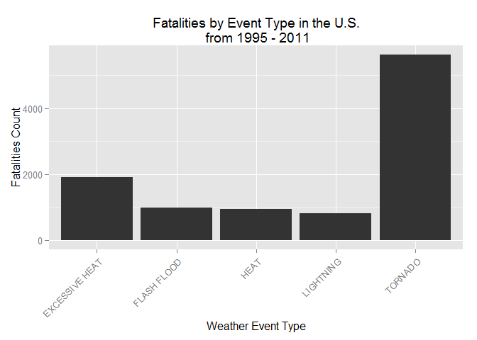
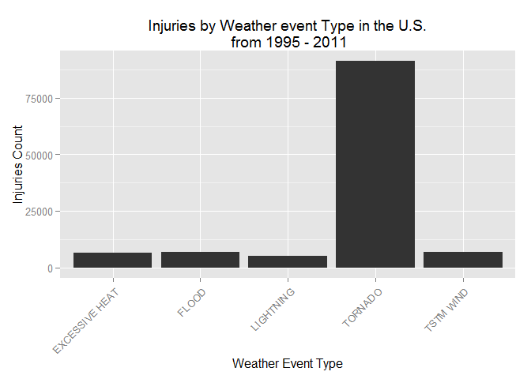
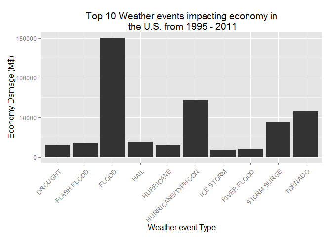

# Reproducible Research: Peer Assessment 2
## Analysis of U.S. National Oceanic and Atmospheric Administration's (NOAA) storm data and their impact on population health and economy

##Synopsis
In this report we are exploring and analysing the U.S. National Oceanic and Atmospheric Administration's (NOAA) storm data collected between the year 1950 and 2011. The objective of this report is to identify the major storms and weather events in the United States that have the most impact on population health in terms of fatalities and injuries and on economy in terms of property & crops damage. Based on the Anlysis performed, the **excessive heat** and **tornado** are most harmful with respect to population health, while **flood**, and **hurricane/typhoon** have the greatest economic consequences.
 
## Load needed libraries

```r
library(ggplot2)
```

```
## Warning: package 'ggplot2' was built under R version 3.1.2
```

```r
library(plyr)
```

```
## Warning: package 'plyr' was built under R version 3.1.2
```

## Data Processing
- First we need to download the data from this URL and save it in our working directory


```r
working_directory <- getwd()
# Download file from URL if doesn't exist
if (!file.exists(paste(working_directory,"repdata-data-StormData.csv.bz2", sep="/"))) 
  {
    download.file("https://d396qusza40orc.cloudfront.net/repdata%2Fdata%2FStormData.csv.bz2", working_directory)
}
```

- Here we will load the data from the CSV file using the **read.table()** and **bzfile** functions 


```r
# Read the data from downloaded file
if (file.exists(paste(working_directory,"repdata-data-StormData.csv.bz2", sep="/"))) {
  storm_data <- read.table(bzfile("repdata-data-StormData.csv.bz2"),sep=",",stringsAsFactors=FALSE,header=TRUE)  
  
}
```


- Limit the dataset to needed columns only to analyze the impact on population health and economy


```r
storm_data <- storm_data [,c("EVTYPE", "FATALITIES", "INJURIES", "PROPDMG", "PROPDMGEXP", "CROPDMG", "CROPDMGEXP")]
head(storm_data)
```

```
##    EVTYPE FATALITIES INJURIES PROPDMG PROPDMGEXP CROPDMG CROPDMGEXP
## 1 TORNADO          0       15    25.0          K       0           
## 2 TORNADO          0        0     2.5          K       0           
## 3 TORNADO          0        2    25.0          K       0           
## 4 TORNADO          0        2     2.5          K       0           
## 5 TORNADO          0        2     2.5          K       0           
## 6 TORNADO          0        6     2.5          K       0
```


- Prepare economy data by converting the exp characters into number 

```r
# get list of unique values in PROPDMGEXP
unique(storm_data$PROPDMGEXP)
```

```
##  [1] "K" "M" ""  "B" "m" "+" "0" "5" "6" "?" "4" "2" "3" "h" "7" "H" "-"
## [18] "1" "8"
```

```r
# replace Null/ special characters with 1  (- ? + )

storm_data$PROPDMGEXP[storm_data$PROPDMGEXP == "" | storm_data$PROPDMGEXP == "-"| storm_data$PROPDMGEXP == "?" | storm_data$PROPDMGEXP == "+"] <- "1"
# replace characters with the corresponding exp number  ( B h H K m M)
storm_data$PROPDMGEXP[storm_data$PROPDMGEXP == "h" | storm_data$PROPDMGEXP == "H"] <- "100"
storm_data$PROPDMGEXP[storm_data$PROPDMGEXP == "k" | storm_data$PROPDMGEXP == "K"] <- "1000"
storm_data$PROPDMGEXP[storm_data$PROPDMGEXP == "m" | storm_data$PROPDMGEXP == "M"] <- "1000000"
storm_data$PROPDMGEXP[storm_data$PROPDMGEXP == "b" | storm_data$PROPDMGEXP == "B"] <- "1000000000"
storm_data$PROPDMGEXP <- as.numeric(storm_data$PROPDMGEXP)
```


```r
# get list of unique values in CROPDMGEXP
unique(storm_data$CROPDMGEXP)
```

```
## [1] ""  "M" "K" "m" "B" "?" "0" "k" "2"
```

```r
# replace Null/ special characters with 1  (- ? + )
storm_data$CROPDMGEXP[storm_data$CROPDMGEXP == "" | storm_data$CROPDMGEXP == "-"| storm_data$CROPDMGEXP == "?" | storm_data$CROPDMGEXP == "+"] <- "1"
# replace characters with the corresponding exp number  ( B h H K m M)
storm_data$CROPDMGEXP[storm_data$CROPDMGEXP == "h" | storm_data$CROPDMGEXP == "H"] <- "100"
storm_data$CROPDMGEXP[storm_data$CROPDMGEXP == "k" | storm_data$CROPDMGEXP == "K"] <- "1000"
storm_data$CROPDMGEXP[storm_data$CROPDMGEXP == "m" | storm_data$CROPDMGEXP == "M"] <- "1000000"
storm_data$CROPDMGEXP[storm_data$CROPDMGEXP == "b" | storm_data$CROPDMGEXP == "B"] <- "1000000000"
storm_data$CROPDMGEXP <- as.numeric(storm_data$CROPDMGEXP)
```

- Calculate impact on economy in cash and insert the values in new variables

```r
storm_data$PROPDMGCash <- storm_data$PROPDMGEXP*storm_data$PROPDMG
storm_data$CROPDMGCash <- storm_data$CROPDMGEXP*storm_data$CROPDMG
```

## Results

## Most harmful events with respect to population health
- Get top 5 fatalities and injuries by event type and plot both graphs


```r
#Aggregate the values per event type
fatalbyevent <- aggregate(FATALITIES ~ EVTYPE, storm_data, sum,na.rm = T)
injurbyevent <- aggregate(INJURIES ~ EVTYPE, storm_data, sum,na.rm = T)


# order event type by 5 most harmful events which caused fatalities
fatalbyevent <- fatalbyevent[order(fatalbyevent$FATALITIES, decreasing = TRUE), ]
fatalities_top5 <- fatalbyevent[1:5, ]
print(fatalities_top5)
```

```
##             EVTYPE FATALITIES
## 834        TORNADO       5633
## 130 EXCESSIVE HEAT       1903
## 153    FLASH FLOOD        978
## 275           HEAT        937
## 464      LIGHTNING        816
```

```r
# order event type by 5 most harmful events which caused injuries

injurbyevent <- injurbyevent[order(injurbyevent$INJURIES, decreasing = TRUE), ]
# 5 most harmful causes of injuries
injurbyevent_top5 <- injurbyevent[1:5, ]
print(injurbyevent_top5)
```

```
##             EVTYPE INJURIES
## 834        TORNADO    91346
## 856      TSTM WIND     6957
## 170          FLOOD     6789
## 130 EXCESSIVE HEAT     6525
## 464      LIGHTNING     5230
```

```r
plot_fatalities <- qplot(EVTYPE, data = fatalities_top5, weight = FATALITIES, geom = "bar", binwidth = 1) + 
  scale_y_continuous("Fatalities Count") + 
  theme(axis.text.x = element_text(angle = 45, hjust = 1)) + xlab("Weather Event Type") + 
  ggtitle("Fatalities by Event Type in the U.S.\n from 1995 - 2011")

plot_injuries <- qplot(EVTYPE, data = injurbyevent_top5, weight = INJURIES, geom = "bar", binwidth = 1) + scale_y_continuous("Injuries Count") + 
  theme(axis.text.x = element_text(angle = 45, hjust = 1)) + xlab("Weather Event Type") + 
  ggtitle("Injuries by Weather event Type in the U.S.\n from 1995 - 2011")


plot_fatalities
```

 

```r
plot_injuries
```

 


- Based on the above histograms, we notice that **Excessive Heat** and **Tornado** caused most fatalities; with respect to injuries, **Tornato** caused most injuries in the United States from 1995 to 2011.


## Most harmful events with respect to economy

- Get top 10 weather event type impacting economy and plot the graph


```r
c<-ddply(storm_data,.(EVTYPE),summarize,PROPDMGCash=sum(PROPDMGCash),CROPDMGCash=sum(CROPDMGCash))

economy_damage<-mutate(c,economy_damage=PROPDMGCash+CROPDMGCash,economy_damage_m=economy_damage/1000000)

# order event type by 10 most harmful events which affected ecconomy
economy_damage_ordered<-arrange(economy_damage,desc(economy_damage_m))
economy_damage_top10 <- economy_damage_ordered[1:10,]

plot_economy_damage<- qplot(EVTYPE, data = economy_damage_top10, weight = economy_damage_m, geom = "bar", binwidth = 1) + 
  theme(axis.text.x = element_text(angle = 45, hjust = 1)) + scale_y_continuous("Economy Damage (M$)") + 
  xlab("Weather event Type") + ggtitle("Top 10 Weather events impacting economy in\n the U.S. from 1995 - 2011")

plot_economy_damage
```

 


- Based on the above histograms, we notice that **Flood** and **hurricane/typhoon** had the most damage impact with respect to economy in the United States from 1995 to 2011.


## Conclusion
Based on the analysis perfoormed, **Tornado** and **Excessive Heat** are most harmful with respect to population health. on the other hand **Flood** and **hurricane/typhoon** had the most damage impact with respect to economy in the United States from 1995 to 2011.

